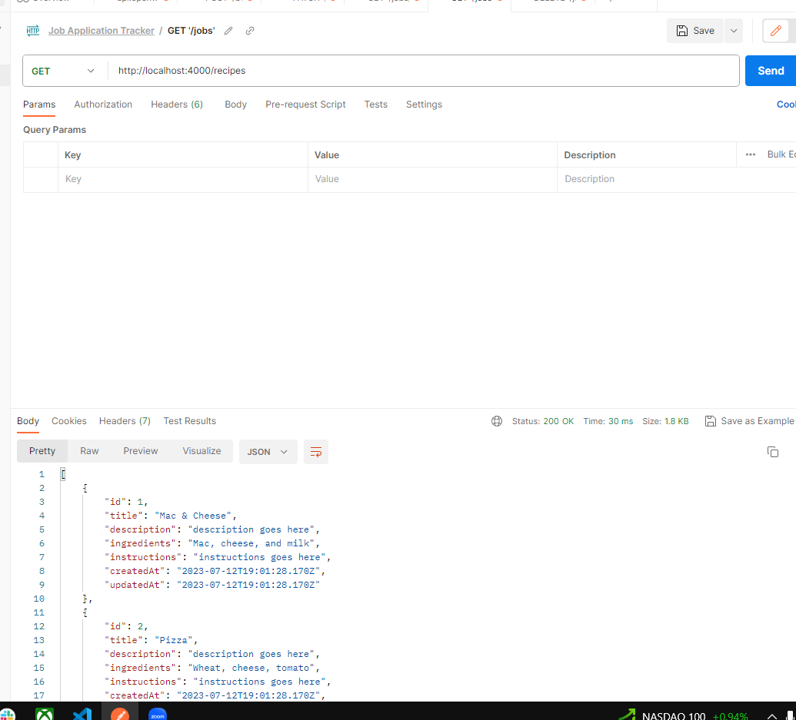
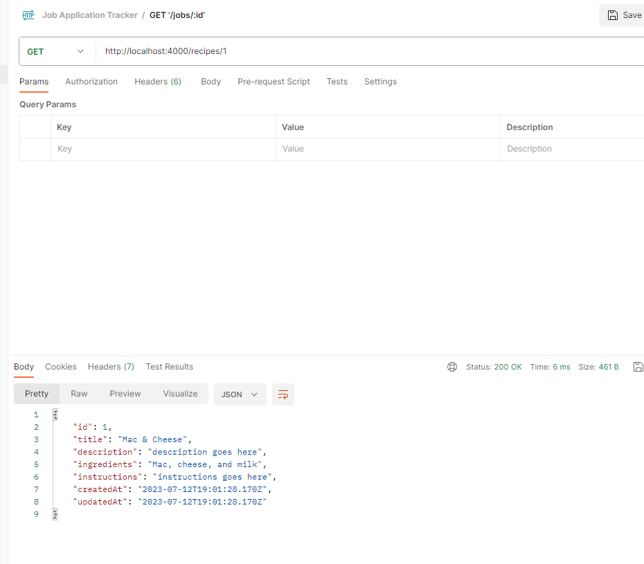
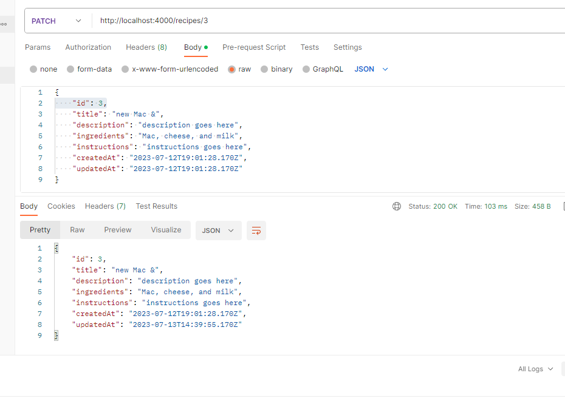
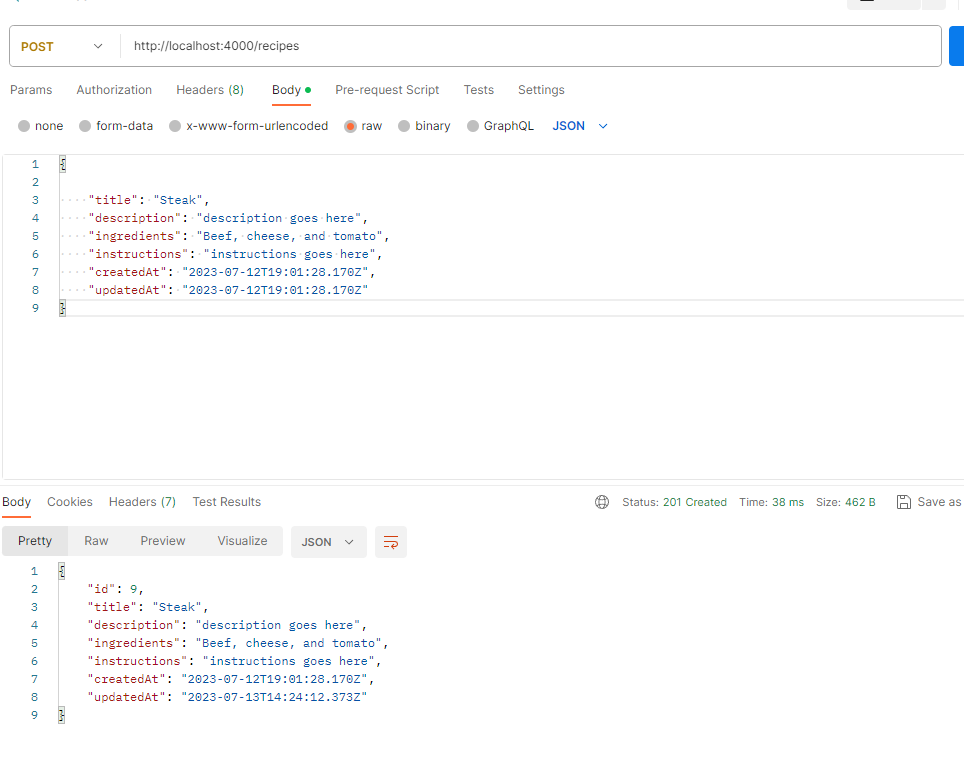

# Recipe management

A web application manage and add recipes.

## Table of Contents
- [Description](#description)
- [Installation](#installation)
- [Usage](#usage)
- [Contributing](#contributing)
- [License](#license)
- [Credits](#credits)

## Description
Recipe management is a web application that allows you to add, edit, and delete recipes. It uses sequelize to interact with the database.

## Installation
To install recipe managemet locally, follow these steps:

1. Clone the repository:
   ```
   git clone https://github.com/AhmedHamza667/RecipeManagement.git
   ```
2. Navigate to the project directory:
   ```
   cd recipeManagement
   ```
3. Install the dependencies:
   ```
   npm install
   ```
4. Run the application:
   ```
   npm start
   ```

## Usage
After installing and running the application, you can use it through API testing tool like Postman. http://localhost:4000/

## Contributing
We welcome contributions to Recipe Management. To contribute, please follow these steps:

1. Fork the repository on GitHub.
2. Create a new branch for your feature or bug fix.
3. Make your changes and ensure that the tests pass.
4. Commit your changes and push them to your fork.
5. Submit a pull request describing your changes and why they should be merged.

## Contributors
- Ahmed Hamza

## License
This project is licensed under the [MIT License](LICENSE).

## Screenshots
Get

Get by id

Patch

Post

Delete
